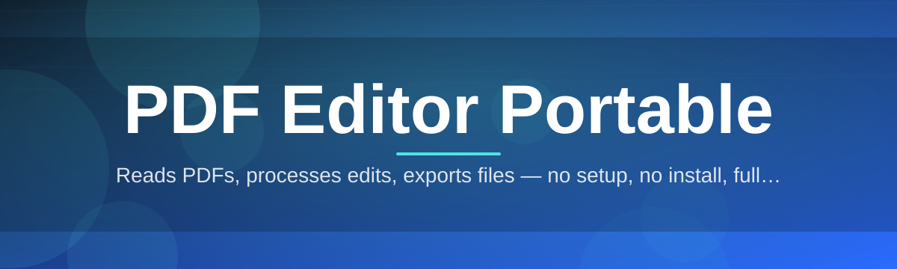
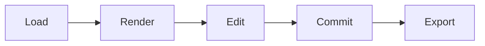

# 📄 pdf-editor-portable-tool 🖋️

  

*A self-contained PDF workstation that runs from a folder, a flash drive, or a network share — no installer, no registry footprint, no waiting.*

  

---

## 🧭 Overview

Editing a PDF should not require a subscription, a background service, or an admin prompt you don't have permission to click. Yet most document tools on the market assume a permanent installation, a signed-in account, and a persistent connection to a vendor's cloud — a mismatch for locked-down workstations, shared kiosks, and technicians who move between machines all day.

**pdf-editor-portable-tool** exists to close that gap. It is a portable PDF editor built for Windows 10/11 that unpacks into a single directory and behaves as a self-contained application: open it, edit, save, and walk away — the host machine is exactly as it was before you arrived. Under the hood it handles the everyday mechanics of document work — merging, splitting, annotating, redacting, form-filling, and re-exporting — through a lightweight native interface rather than a browser wrapper pretending to be desktop software.

It is built for the people who actually touch PDFs for a living: IT technicians provisioning fleets of machines, legal and compliance staff who cannot install unapproved software, field engineers working offline, and anyone who simply wants a portable PDF editor that respects the difference between "installed" and "borrowed." The 2026 release line focuses on predictability — same binary, same behavior, every machine, every time.

> [!NOTE]
> The download button above routes to the official project landing page, where the current build, changelog, and checksums are published together.

---

## 🧩 What's Inside the Box

| Capability | What It Actually Does |
|---|---|
| **Zero-Footprint Runtime** | Runs entirely from its own folder — no installer, no services registered, no leftovers after the drive is unplugged. |
| **Page Surgery Suite** | Merge, split, reorder, rotate, or extract pages across multiple PDFs with a drag-and-drop page tray. |
| **True Text & Object Editing** | Click into existing paragraphs and images to adjust content directly, instead of stacking annotation layers on top. |
| **Form Field Composer** | Detects and fills AcroForm fields, or builds new fillable fields from scratch for reusable templates. |
| **Redaction, Not Just Cover-Up** | Permanently removes underlying text and image data in redacted regions rather than painting a black box over it. |
| **Batch Conversion Engine** | Converts stacks of PDFs to and from images, or flattens editable documents into shareable final copies. |
| **Digital Signature Blocks** | Places signature fields and applies certificate-based or drawn signatures for lightweight document sign-off. |
| **Session Memory, No Cloud** | Remembers recent files and window layout locally in a config file that travels with the tool, never a remote account. |

> [!TIP]
> Keep the entire application folder on an encrypted USB drive for a genuinely portable PDF editing kit you can carry between air-gapped machines.

---

## 🚀 Getting Started

<strong>Click to expand the four-step setup</strong>

1. **Visit the landing page** using the download button on this page — it always points to the current build.

2. **Download the archive** and extract it to any writable location: desktop, USB stick, or network share.

3. **Launch the executable** directly — there is no setup wizard, no license activation screen, no reboot required.

4. **Open a PDF** via drag-and-drop or the in-app file browser, and start editing immediately.

> [!IMPORTANT]
> Because the tool writes nothing outside its own folder by default, moving or deleting that folder fully removes it from the machine — a deliberate design choice for portability.

---

## 🖥️ System Requirements

| Component | Minimum | Notes |
|---|---|---|
| **OS** | Windows 10 (64-bit) | Windows 11 fully supported |
| **Dependencies** | None | Fully self-contained, no runtime installs needed |
| **RAM** | 2 GB | 4 GB+ recommended for large multi-page batches |
| **Storage** | ~150 MB | Plus space for the documents you're editing |
| **Permissions** | Standard user | Administrator rights are never required |

  

---

## ⚙️ How It Works

The application follows a straightforward, predictable pipeline every time a document is opened, edited, and saved — no hidden background sync, no telemetry round-trip.

1. **Load** — the PDF's object structure is parsed directly from disk into memory.

2. **Render** — pages are rasterized on demand for display, keeping memory usage flat regardless of document length.

3. **Edit** — user actions (text edits, redactions, form fills) are queued as discrete, reversible operations.

4. **Commit** — queued operations are applied to the document object tree in a single pass.

5. **Export** — the modified structure is written back out as a clean, standards-compliant PDF.

---

## 🛠️ Troubleshooting

<strong>The tool won't launch from a USB drive on a locked-down PC</strong>

Some enterprise group policies block execution from removable media entirely. Copy the folder to a local temp directory first, or request an exception for the specific executable path.

<strong>Redacted content still shows up when I copy-paste from the exported PDF</strong>

Confirm you used the redaction tool's "apply" step rather than just drawing a shape — the shape-only path is a cosmetic overlay, while "apply" strips the underlying data permanently.

<strong>Large scanned PDFs feel sluggish when scrolling</strong>

Enable the "low-res preview" toggle in Settings → Performance; it renders thumbnails at reduced resolution until a page is actively viewed at full zoom.

<strong>Form fields I created aren't saving values on reopen</strong>

Check that the export was saved as a standard PDF and not "flattened," which intentionally converts fields into static content.

<strong>Antivirus flags the portable executable on a new machine</strong>

This is a common false positive for unsigned portable tools. Verify the checksum published on the landing page against your downloaded file before whitelisting it.

> [!WARNING]
> Always verify checksums after downloading on a new machine — a mismatched hash means the file was altered or corrupted in transit, not that the tool is unsafe by design.

---

## 🎨 UI / UX Details

| Shortcut | Action |
|---|---|
| `Ctrl + O` | Open a PDF |
| `Ctrl + S` | Save in place |
| `Ctrl + Shift + S` | Save as / export |
| `Ctrl + M` | Merge documents |
| `Ctrl + R` | Rotate current page |
| `Ctrl + Shift + R` | Open redaction mode |
| `Ctrl + F` | Search within document |
| `F11` | Toggle full-screen reading mode |

- Light and dark themes, switchable instantly without a restart.

- A "compact toolbar" mode for smaller screens or kiosk touch displays.

- Per-session settings stored in a local `.ini` file that travels with the portable folder.

> [!NOTE]
> Theme and layout preferences are stored next to the executable, not in the Windows registry — deleting the folder deletes the preferences too.

---

## 🤝 Contributing & Community

> [!TIP]
> Bug reports that include a sample (non-sensitive) PDF and reproduction steps get triaged fastest.

- Open an issue for bugs, rendering quirks, or feature requests.

- Discussions are welcome for workflow ideas — especially around batch processing and form automation.

- Pull requests should target a single, well-scoped change with a clear description of the before/after behavior.

---

## 📜 License

Released under the [MIT License](LICENSE), 2026. Use it, fork it, embed it in your own toolchain — attribution appreciated, not required.

---

## ⚖️ Disclaimer

This project is provided "as is," without warranty of any kind, for general-purpose PDF editing tasks. It is not a substitute for professional legal, compliance, or document-retention advice — verify redaction and export results independently before relying on them in sensitive or regulated workflows.

